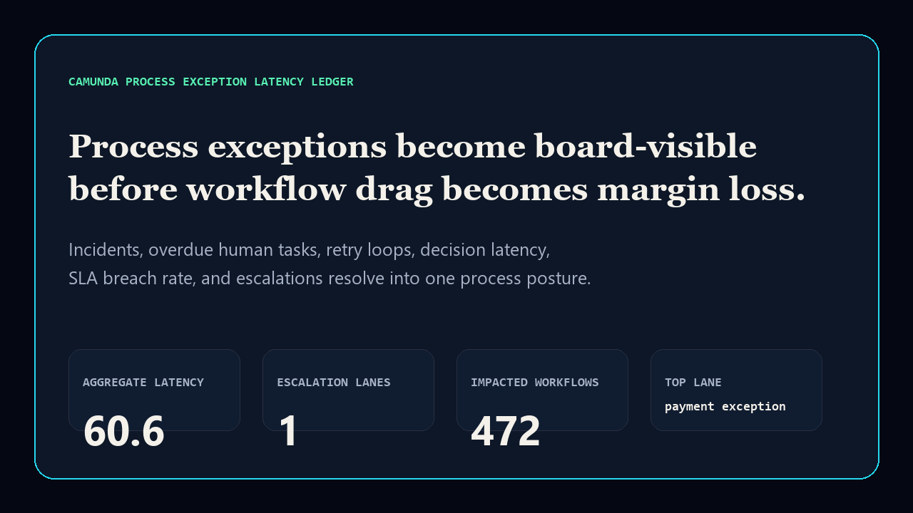
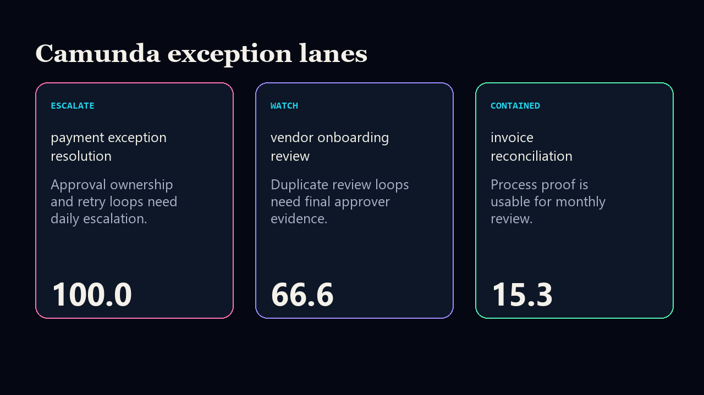

# camunda-process-exception-latency-ledger

[](https://github.com/mizcausevic-dev/camunda-process-exception-latency-ledger/actions/workflows/ci.yml)
[](https://github.com/mizcausevic-dev/camunda-process-exception-latency-ledger/actions/workflows/pages.yml)
[](LICENSE)

Camunda-aligned process exception latency ledger for incident backlog, human-task drag, retry loops, decision latency, SLA breach exposure, and unresolved escalations.

- Live: https://mizcausevic-dev.github.io/camunda-process-exception-latency-ledger/
- Repo: https://github.com/mizcausevic-dev/camunda-process-exception-latency-ledger




## Why this exists

Process automation becomes board-relevant when failed instances, human-task backlog, retry loops, and unresolved escalations start delaying revenue, procurement, finance, or compliance workflows. This repo converts Camunda-like operational data into one executive-readable latency ledger.

## What it includes

- TypeScript scoring engine and CLI
- fixture-based Camunda process exception model
- BPMN process contract for the highest-risk lane
- SQL extraction contract for warehouse-backed process telemetry
- static GitHub Pages surface
- README proof renders
- CI coverage, SQL/BPMN checks, prerender smoke test

## Local run

```bash
npm install
npm run verify
npx camunda-process-exception-latency-ledger fixtures/process-exception-latency.json --format=json
```

## Board-readable output

- aggregate process latency score
- escalation-lane count
- impacted workflow estimate
- posture per process lane: `escalate`, `watch`, or `contained`
- primary recommendation tied to the highest-risk process
